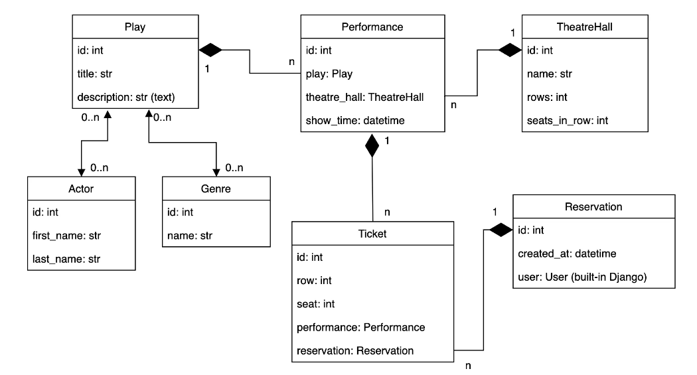

# Theatre API Service

## Description
This project is an API service for abstract theatre where client can go online 
and reserve tickets for the specific performance. 
Clients also can view current sets of actors, genres
and plays. Website admins on the other hand can 
create and manage actor lists, genres, create new 
plays and setup performances.

## How to run
1. Clone repository into desired folder:
    ```
    git clone https://github.com/mykolamateichuk/theatre-api-service .
    ```
2. Build and run using [Docker](https://docs.docker.com/engine/install/):
    ```
    docker-compose up --build
    ```
   >To run again use: `docker-compose up`

## Features

- Filtering
- JWT Authentication
- Useful admin panel
- Documentation
- Permissions

## DB Schema

